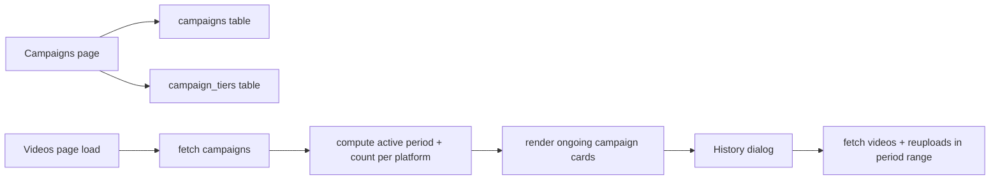

# Campaign Day — Feature Plan

## Ringkasan (Summary)

Campaign = satu tempoh (duration) dengan target upload video di **satu platform sahaja**, berulang ikut cadence (daily/weekly/monthly). Setiap kitaran (period) ada **tier** — berapa banyak video perlu diupload dalam period itu untuk capai reward. Progress reset setiap period. History (optional) untuk tengok prestasi & tier yang dicapai pada period-period lepas.

## Model Data

### Cara kerja period & tier (hasil sesi penjelasan)

- **repeat_interval** (`daily` | `weekly` | `monthly`) = berapa kerap period reset.
- **Tier** = ambang terkumpul **dalam satu period** (bukan keseluruhan campaign). Contoh weekly campaign 3 tier: tier 1 = 10 video → RM500, tier 2 = 20 → RM1000, tier 3 = 50 → RM3000. Setiap minggu progress mula 0 dan dikira semula; tier yang dicapai = tier tertinggi dengan target_videos <= count.
- **Platform** = 1 campaign hanya 1 platform (youtube/tiktok/facebook/instagram/shopee/threads).
- **end_date kosong** = continuous (tiada tarikh tamat) sehingga di-set kemudian.
- **track_history** = toggle untuk paparkan history period lepas.

### Pengiraan period (penting — disahkan oleh user)

Period dijana **berpaut pada start_date**, berulang ikut cadence sehingga `end_date` (atau sehingga kini jika continuous). Period **terakhir boleh separuh** (partial).

- **weekly**: start 1 Ogos, end 31 Ogos → periods `1-7`, `8-14`, `15-21`, `22-28`, `29-31` = **5 minggu** (period terakhir 3 hari sahaja).
- **monthly**: start 1 Ogos, end 31 Okt → periods `1-31 Ogos`, `1-30 Sep`, `1-31 Okt` = **3 bulan** (mengikut kalendar, bukan +30 hari).
- **daily**: setiap hari.

Contoh weekly start 1 Ogos: period 1 = `1-7 Ogos`, period 2 = `8-14 Ogos`, ..., period 5 = `29-31 Ogos`. Anchor sentiasa pada start_date, kitaran seterusnya = tarikh mula period + 7 hari (weekly) / + 1 bulan (monthly, ikut kalendar) / + 1 hari (daily). Period terakhir berhenti bila melebihi end_date, dan julat diklik ke end_date.

### Jadual baru (dalam fail SQL migration baru, bukan edit `migrations.sql`)

**`campaigns`**
| Column | Type | Keterangan |
|--------|------|-----------|
| id | UUID PK | `gen_random_uuid()` |
| name | TEXT NOT NULL | Nama campaign |
| platform | TEXT NOT NULL | Platform sasaran |
| repeat_interval | TEXT NOT NULL | `daily`/`weekly`/`monthly` (CHECK) |
| start_date | DATE NOT NULL | Tarikh mula |
| end_date | DATE NULL | Null = continuous |
| track_history | BOOLEAN NOT NULL DEFAULT false | Toggle history |
| created_at | TIMESTAMPTZ DEFAULT NOW() | |

- `end_date` = source of truth. **Tiada field duration** (user nak guna start_date + end_date sahaja; end_date boleh kosong untuk continuous).
- Index: `idx_campaigns_end_date ON campaigns(end_date)` dan `idx_campaigns_platform ON campaigns(platform)`.
- RLS: `ENABLE ROW LEVEL SECURITY` + policy `FOR ALL TO authenticated USING(true) WITH CHECK(true)` — konsisten dengan `reuploads` / `bolreview_uploads` (app ini single-pool global, tiada user_id pada videos).

**`campaign_tiers`**
| Column | Type | Keterangan |
|--------|------|-----------|
| id | UUID PK | `gen_random_uuid()` |
| campaign_id | UUID NOT NULL | FK `campaigns(id)` ON DELETE CASCADE |
| tier_number | INT NOT NULL | 1, 2, 3... |
| target_videos | INT NOT NULL | Ambang (e.g. 10) |
| reward | TEXT NULL | e.g. `RM500` |
| created_at | TIMESTAMPTZ DEFAULT NOW() | |

- `UNIQUE(campaign_id, tier_number)`.
- RLS sama seperti di atas.
- Index: `idx_campaign_tiers_campaign_id ON campaign_tiers(campaign_id)`.

### Kiraan progress per period

Guna konvensyen sedia ada (stat card / Original Creator weekly):
- **Original count** = `videos` di mana `{platform}_upload_date` dalam julat period.
- **Reupload count** = `reuploads` di mana `platform = campaign.platform` DAN `upload_date` dalam julat period.
- **Total uploads** = original + reupload (sama seperti stat card "Total platform uploads").
- **Tier dicapai** = tier tertinggi di mana `target_videos <= total_uploads`; jika tiada tier dicapai = Tier 0 / "Belum capai tier".

## Struktur Fail

```
supabase/
  campaign-tables.sql          # BARU: campaigns + campaign_tiers + RLS + index
src/
  lib/
    campaigns.ts               # BARU: types + CRUD + period/tier compute helpers
  pages/
    Campaigns.tsx              # BARU: page penuh pengurusan campaign (admin) + list + dialog
    Videos.tsx                 # EDIT: section "Campaign" + card ongoing + past campaign card
  App.tsx                      # EDIT: tambah route /campaigns
  components/Layout.tsx        # EDIT: tambah nav item Campaigns (admin sahaja)
```

## UI

### 1. Campaigns.tsx (BARU — page penuh, admin)

Page baru `/campaigns` supaya page Settings tidak sesak.

- **Header**: "Campaigns" + butang "+ New Campaign".
- **List** semua campaign: nama, platform, repeat, start–end date, status (Ongoing/Ended), toggle `track_history`, butang Edit/Delete.
- **Dialog create/edit campaign**: nama, platform (select 6 platform), repeat_interval (select), start_date, end_date (kosong = continuous), toggle `track_history`.
- **Dialog edit tier** (dalam create/edit): senarai tier berurutan — `tier_number`, `target_videos`, `reward`; tambah/buang baris tier. Boleh kosong (tiada tier).
- Guna `useAuth()` → redirect jika bukan admin (ikut corak `Settings.tsx`).

### 2. Videos.tsx — section Campaign

Letakkan **selepas grid stat card** (selepas line ~1402) & sebelum/bersama "Past Campaign" card sedia ada (line 1404-1430).

- **"Campaign" section header** + butang "Manage Campaigns" (admin sahaja, navigate ke `/campaigns`).
- **Grid card ongoing campaign** — satu card per campaign aktif (`end_date` null ATAU `end_date >= today`):
  - Badge period: `Week 3` / `Day 12` / `Month 2` + `Repeat weekly/monthly/daily`.
  - Nama campaign + icon platform + platform label.
  - Julat tarikh period semasa: `Sen, 01 Jan – Aha, 07 Jan`.
  - Progress: `count / target_videos` (target = tier tertinggi) dengan progress bar (guna warna sama corak `OriginalCreatorCard`).
  - Chip tier dicapai: `✓ Tier 2` / `⏳ In Progress`.
  - Butang **"History"** (hanya jika `track_history` true) → buka dialog history.
- **Past Campaigns card** — guna semula "Past Campaign" card sedia ada (line 1404-1430) tetapi tukar onClick ke dialog baru senarai campaign tamat. Jika tiada campaign tamat, card masih ditunjukkan ("Belum ada campaign tamat").

### 3. Dialog History (per campaign, jika track_history)

- Senarai period lepas (reverse chronological): label period (W3/M2/D12), julat tarikh, jumlah upload, tier dicapai + progress bar.
- Item boleh diklik → filter videos page untuk platform campaign pada julat period tersebut (guna corak `weeklyHistory` onClick: set `platformFilter` + `customUploadDateFilter`/date range). Minimum: paparan sahaja, klik optional.

### 4. Dialog Past Campaigns

- Senarai semua campaign tamat (`end_date < today`): nama, platform, tempoh, **paling tinggi tier yang pernah dicapai** sepanjang campaign, butang "View History" (jika track_history).

## Aliran Data (data flow)



## Langkah Pelaksanaan (Execution Steps)

1. **SQL migration** — `supabase/campaign-tables.sql`: create `campaigns` + `campaign_tiers`, RLS, indexes. Jalankan di Supabase SQL editor.
2. **Data layer** — `src/lib/campaigns.ts`: types (`Campaign`, `CampaignTier`, `CampaignWithTiers`), CRUD (fetch/create/update/delete), helpers:
   - `computePeriods(campaign, asOfDate)` → senarai `{periodNumber, start, end}` berpaut pada start_date ikut cadence (weekly anchor start_date, monthly ikut kalendar, last period partial).
   - `computeCurrentPeriod(campaign, today)` → period aktif sekarang.
   - `computeUploadCount(platform, from, to)` → guna supabase query pada videos + reuploads.
   - `resolveTier(count, tiers)` → tier tertinggi dicapai.
3. **Campaigns page** — `src/pages/Campaigns.tsx`: list + create/edit dialog + tier editor + delete. Redirect bukan admin.
4. **Routing/App** — edit `src/App.tsx`: tambah lazy import + route `campaigns`. Edit `src/components/Layout.tsx`: tambah nav item (admin sahaja).
5. **Videos UI** — edit `src/pages/Videos.tsx`: import data layer, fetch campaigns dalam `useEffect` sedia ada, render section Campaign + card ongoing + history dialog + past campaign dialog; kekalkan "Past Campaign" card (re-point onClick).
6. **History compute** — dalam `Videos.tsx`: untuk setiap period lepas, kira count guna helper + resolve tier; papar dalam dialog.
7. **Test** — jalankan `npm run dev`, sahkan CRUD di /campaigns, card di Videos, history berfungsi. Pastikan migration dijalankan.
